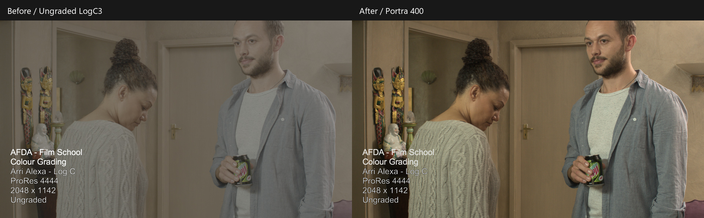
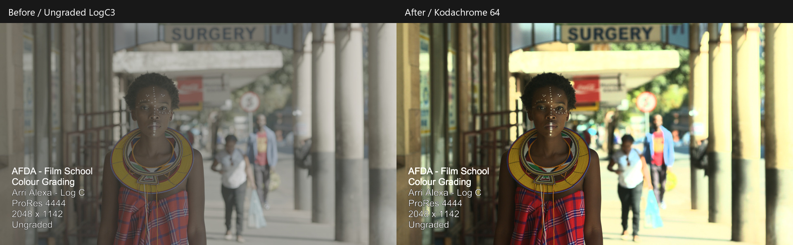
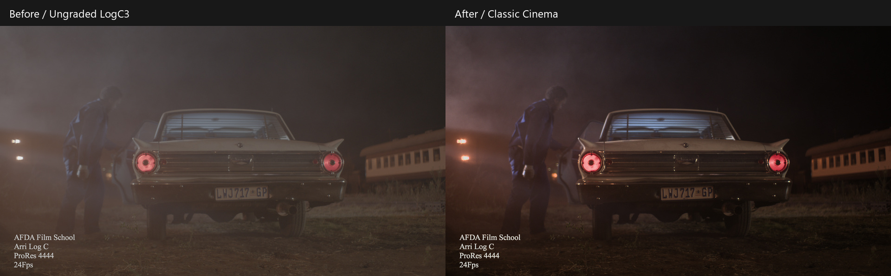
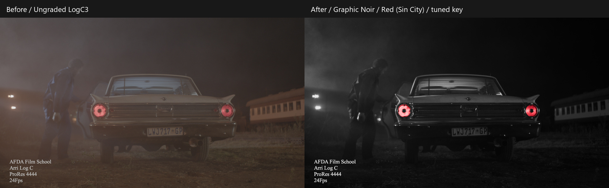

# OpenEmulsion

Free, open-source film emulation for DaVinci Resolve. OpenEmulsion is a native OpenFX plugin with adjustable film color, print response, grain, halation, bloom, and creative presets.

Use the complete film pipeline or enable individual modules alongside your own grade and LUTs.

**v0.44.0 | Windows x64 | Experimental**

Test on copies of important projects.

## Features

- **Film Color:** negative color and tone response, exposure, white balance, density, saturation, contrast, and highlight controls.
- **Film Development:** Push/Pull, Richness, and Split Tone.
- **Print:** Full (Film Print), Standard, Extended (Telecine), and editable Custom styles.
- **Grain:** procedural styles with adjustable size, softness, roughness, color, tonal weighting, and RGB intensity. Optional negative-driven grain before Print.
- **Halation and Aura:** red/amber highlight glow with separate intensity and radius controls.
- **Bloom:** neutral or source-colored highlight diffusion with its own selection, spread, and highlight protection.
- **Selective Color:** retain a selected hue in an otherwise monochrome image, with a selection-matte preview.
- **Film Gauges:** 8 mm, Super 8, 16 mm, Super 16, 35 mm, Super 35, 65 mm, 70 mm, and Custom.
- **Presets:** 52 editable stock, print, movie, and genre looks, including Neutral / Clean Slate. Save and load complete looks as portable `.oepreset` files.
- **Color Management:** camera-log and working-space inputs, SDR Rec.709/sRGB rendering, and experimental HDR Rec.2100 PQ output.
- **Performance:** OpenCL acceleration with a multithreaded CPU fallback.

Each module has an Enable toggle. Modes include Full, Color Only, Halation/Bloom/Grain Only, Grain Only, Bypass, and diagnostic mattes. Disabled modules retain their settings and grey out their controls.

## Before and After

Left: untreated LogC3 footage. Right: OpenEmulsion with the named preset and SDR output. Each pair uses the same frame, with no extra grading. These color-only examples show both log-to-SDR rendering and the preset look, without grain, halation, or bloom. Sample footage: AFDA Film School; source credits are retained in the frames.







<details>
<summary>Selective Color: Graphic Noir / Red</summary>

The red key is tuned for this shot: Keep Hue 355 degrees, Hue Range 8 degrees, Hue Feather 3 degrees, and Minimum Saturation 0.80.



</details>

## Install

1. Download the Windows x64 ZIP from [Releases](https://github.com/technomancer702/openemulsion/releases).
2. Close DaVinci Resolve and extract the ZIP.
3. Copy the entire `OpenEmulsion.ofx.bundle` folder to:
   `C:\Program Files\Common Files\OFX\Plugins`
4. Restart Resolve and find **OpenFX > OpenEmulsion > OpenEmulsion**.

Windows may request administrator approval. Keep the bundle's contents intact and install only one copy. No compiler, Python, or DCTL is needed for the prebuilt plugin.

See the [installation guide](release/INSTALL.md) for updates, uninstalling, and troubleshooting.

## Quick Start

1. Add OpenEmulsion to a node.
2. Set **Input Color Space** to the space actually entering that node.
3. Choose an output workflow, then select a preset or adjust the modules.

| Workflow | Settings |
| --- | --- |
| Log footage to SDR | Choose the camera input, **Rec.709 / Gamma 2.4** output, and **Auto** rendering. |
| Direct HDR PQ | Select **Standard HDR (PQ)**; this also selects **Rec.2100 / PQ (Rec.2020)** output. Adjust HDR Viewing for your target. |
| Resolve-managed RCM/ACES | Choose the incoming working space, **Same as Input** output, and **Conversion Only**. Let Resolve handle the output transform. |
| Your own LUT or grade | Use a texture-only mode and choose the incoming space. Texture-only modes preserve the input encoding. |

Supported inputs include ARRI LogC3 (EI 800), LogC4, Sony S-Log3, Blackmagic Film Gen 5, RED Log3G10, Canon Log 2/3, Panasonic V-Log, DaVinci Wide Gamut/Intermediate, ACEScct, ACEScg, Rec.709, sRGB, and linear Rec.709.

Input color space is not auto-detected. Configure HDR monitoring and export in Resolve separately, and avoid applying a second output transform to rendered SDR/PQ. See [Color Spaces](docs/COLOR_SPACES.md) for exact gamut pairs and workflow details.

## Build From Source

### Requirements

- Windows x64.
- DaVinci Resolve's OpenFX developer files.
- CMake 3.20+, Ninja, and a C++17 compiler on `PATH`.
- PowerShell for build and test scripts.
- The tested toolchain is MinGW-w64 GCC. Other compilers need verification.
- An OpenCL-capable GPU/driver for GPU rendering; no OpenCL SDK is required to compile.

The default SDK location is:

```text
C:\ProgramData\Blackmagic Design\DaVinci Resolve\Support\Developer\OpenFX
```

It must contain both `OpenFX-1.4` and `Support`.

Run from the project root:

```powershell
.\tools\build_ofx.ps1
ctest --test-dir build/ofx --output-on-failure
```

For a different SDK location:

```powershell
.\tools\build_ofx.ps1 -ResolveOpenFXRoot "D:\SDKs\OpenFX"
```

The built bundle is at `dist/OpenEmulsion.ofx.bundle`. To install a development build, close Resolve and run:

```powershell
.\tools\install_ofx.ps1
```

This installs into the project's `ofx-plugins` folder and adds it to your user `OFX_PLUGIN_PATH`. Keep the project folder in place and restart Resolve from the Start Menu or a new shell. Alternatively, use the manual installation above.

## Documentation

- [Film Color and Print](docs/FILM_RESPONSE.md), [Film Development](docs/FILM_DEVELOPMENT.md), and [Module Controls](docs/MODULE_CONTROLS.md)
- [Grain, Halation, and Film Gauges](docs/TEXTURE_CONTROLS.md), [Bloom](docs/BLOOM.md), and [Selective Color](docs/SELECTIVE_COLOR.md)
- [Built-in Presets](docs/LOOK_PRESETS.md) and [User Presets](docs/USER_PRESETS.md)
- [Color Spaces and SDR/HDR Viewing](docs/COLOR_SPACES.md)
- [Development and Release Packaging](docs/DEVELOPMENT.md), [Versioning](docs/VERSIONING.md), and [Roadmap](docs/ROADMAP.md)
- [Release Notes](release/RELEASE_NOTES.md)

## Compatibility

Windows x64 is currently supported; macOS, Linux, and native Windows ARM builds are not available. Development testing uses DaVinci Resolve 21.1.1 on Windows.

OpenCL acceleration requires Resolve to supply OpenCL image buffers. Otherwise, the plugin uses its CPU fallback. CUDA and Metal are not implemented.

HDR PQ output is experimental. HLG, PQ input, and HDR export metadata are not implemented.

## Contributing

Bug reports, preset suggestions, footage-based feedback, and pull requests are welcome. See [Contributing](CONTRIBUTING.md). For bugs, include your Resolve version, GPU/driver, color-space settings, and steps to reproduce.

## License

[MPL-2.0](LICENSE). See [Third-Party Notices](THIRD_PARTY_NOTICES.md) for dependency licenses.
